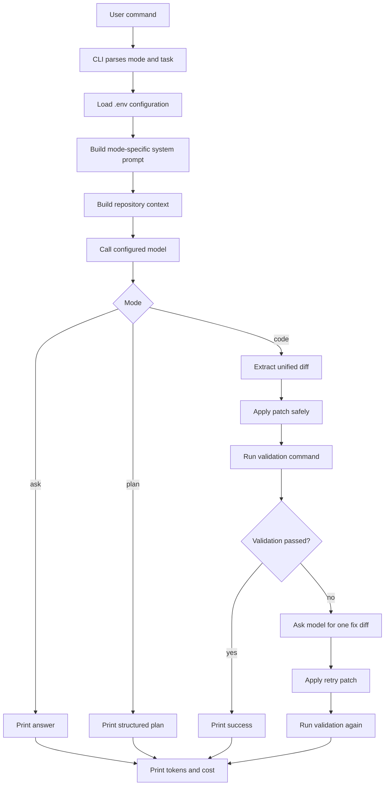

# Agent Zero

Build a coding agent from scratch, one visible step at a time.

Agent Zero is a small educational coding agent built to understand how tools
like Claude Code, Codex, Cursor, and other agentic coding systems work under
the hood. It is not trying to be the most powerful agent. It is trying to be
the clearest one.

The project intentionally keeps the core loop simple:

1. Read the user request.
2. Inspect the repository.
3. Select useful context.
4. Call an AI model.
5. Ask for an answer, plan, or patch.
6. Apply the patch when allowed.
7. Run validation.
8. Show tokens, estimated cost, and final result.

No MCP. No plugin marketplace. No hidden framework. Just a small harness that
makes the moving parts of a coding agent visible.

## Why This Exists

I built Agent Zero to learn how coding agents actually work.

Using a polished agent is useful, but building one teaches different lessons:

- Why context selection matters more than simply reading every file.
- Why `ask`, `plan`, and `code` need different permissions.
- Why patches are safer than asking a model to rewrite whole files.
- Why validation turns a chatbot into a workflow.
- Why token usage and model choice directly affect cost and quality.
- Why small open source or hosted models need a careful harness around them.

This repository is meant to be read, changed, broken, repaired, and explained.
It is a learning project first.

## What You Will Learn

By following this project, you should understand the building blocks of a
minimal coding agent:

- CLI design with `typer`.
- `.env` based configuration.
- OpenAI-compatible model calls.
- Internal asynchronous Bedrock gateway calls.
- Repository context selection.
- Safe file reading and search.
- Prompt design for multiple modes.
- Unified diff extraction.
- Safe patch application.
- Validation command execution.
- One retry after validation failure.
- Token and cost visibility.

The point is not magic. The point is to make the magic inspectable.

## Current Capabilities

Agent Zero currently supports three modes.

| Mode | Edits files? | Runs validation? | Purpose |
| --- | --- | --- | --- |
| `ask` | No | No | Ask repo-aware questions |
| `plan` | No | No | Generate an implementation and validation plan |
| `code` | Yes | Yes, if configured | Apply a focused patch and validate it |

Supported providers:

- OpenAI-compatible APIs.
- Internal asynchronous Bedrock gateway.
- Local OpenAI-compatible model servers, if available.

Supported tools:

- Repository file listing.
- Safe text file reading.
- Text search.
- Query-aware context ranking.
- Unified diff parsing.
- Safe patch application.
- Validation command execution.
- Token usage and estimated cost reporting.
- JSON eval runs for repeatable model comparison.

## How The Agent Loop Works



The important idea is that Agent Zero separates thinking from acting.

`ask` and `plan` can inspect, but they cannot edit. `code` can edit, but only by
returning a patch that passes local safety checks.

## Project Structure

```text
agent-zero/
|-- agent_zero/
|   |-- __init__.py
|   |-- __main__.py
|   |-- cli.py
|   |-- config.py
|   |-- context.py
|   |-- diff_parser.py
|   |-- model_client.py
|   |-- usage.py
|   `-- tools/
|       |-- command_tool.py
|       |-- file_tools.py
|       `-- patch_tool.py
|-- docs/
|   `-- high-level-design.md
|-- tests/
|-- .env.example
|-- pyproject.toml
|-- requirements.txt
`-- README.md
```

Key files:

- `agent_zero/cli.py`: command entry point and orchestration.
- `agent_zero/config.py`: `.env` and environment loading.
- `agent_zero/model_client.py`: OpenAI-compatible and Bedrock gateway clients.
- `agent_zero/context.py`: repository context selection.
- `agent_zero/diff_parser.py`: model response to unified diff extraction.
- `agent_zero/tools/patch_tool.py`: safe patch application.
- `agent_zero/tools/command_tool.py`: validation command execution.
- `agent_zero/usage.py`: token and cost calculation.

## Quick Start

### 1. Clone the repository

```bash
git clone https://github.com/pawanraocse/agent-zero.git
cd agent-zero
```

### 2. Create a virtual environment

```bash
python3 -m venv .venv
source .venv/bin/activate
```

### 3. Install dependencies

```bash
pip install -r requirements.txt
```

### 4. Create your local environment file

```bash
cp .env.example .env
```

Do not commit `.env`. It contains local secrets.

## Configure A Model Provider

Agent Zero needs an AI model. The harness is the agent, but the model is still
the reasoning engine that answers, plans, and writes patches.

### Option A: OpenAI-Compatible API

Use this for OpenAI or any server that exposes an OpenAI-compatible API.

```bash
AGENT_ZERO_PROVIDER=openai
AGENT_ZERO_BASE_URL=https://api.openai.com/v1
AGENT_ZERO_API_KEY=your_api_key_here
AGENT_ZERO_MODEL=gpt-4.1-mini
```

### Option B: Internal Bedrock Gateway

Use this when your organization exposes Bedrock through an async HTTP gateway.

```bash
AGENT_ZERO_PROVIDER=bedrock
AGENT_ZERO_MODEL=anthropic.claude-haiku-4-5-20251001-v1:0
AGENT_ZERO_BEDROCK_URL=https://your-gateway.example.com/dev/ai/v1/bedrock
AGENT_ZERO_BEDROCK_AUTH_HEADER=x-api-key: your_key_here
AGENT_ZERO_BEDROCK_TENANT_ID=11221122
AGENT_ZERO_TOP_P=0.2
AGENT_ZERO_MAX_TOKENS=4096
AGENT_ZERO_BEDROCK_POLL_INTERVAL_SECONDS=1
AGENT_ZERO_BEDROCK_TIMEOUT_SECONDS=120
```

The Bedrock gateway flow is asynchronous:

```text
POST {AGENT_ZERO_BEDROCK_URL}
  -> returns request id

GET {AGENT_ZERO_BEDROCK_URL}/{request_id}?tenantId={tenant_id}
  -> returns final model response
```

Agent Zero handles the polling loop for you.

### Option C: Local OpenAI-Compatible Server

If your machine can run a local model server, point Agent Zero at it:

```bash
AGENT_ZERO_PROVIDER=openai
AGENT_ZERO_BASE_URL=http://localhost:1234/v1
AGENT_ZERO_API_KEY=not-needed
AGENT_ZERO_MODEL=qwen2.5-coder
```

This is useful for learning portability, but local model setup depends on your
machine and network restrictions.

## Configure Validation

`code` mode can run a validation command after applying a patch.

Simple setup:

```bash
AGENT_ZERO_VALIDATION_COMMAND=.venv/bin/python -m pytest
AGENT_ZERO_VALIDATION_TIMEOUT_SECONDS=120
```

Layered setup:

```bash
AGENT_ZERO_TEST_COMMAND=.venv/bin/python -m pytest
AGENT_ZERO_LINT_COMMAND=.venv/bin/python -m ruff check .
AGENT_ZERO_FORMAT_COMMAND=.venv/bin/python -m ruff format --check .
AGENT_ZERO_VALIDATION_TIMEOUT_SECONDS=120
```

If `AGENT_ZERO_VALIDATION_COMMAND` is set, Agent Zero uses that single command.
Otherwise it runs the configured test, lint, and format commands in that order,
stopping at the first failure.

When validation fails, Agent Zero sends the failure output back to the model and
allows one corrective patch attempt.

The retry limit is intentional. It keeps the first version easy to reason about.

## Configure Token And Cost Tracking

To see estimated cost after each model call, add your model pricing:

```bash
AGENT_ZERO_INPUT_COST_PER_1M_TOKENS=1
AGENT_ZERO_OUTPUT_COST_PER_1M_TOKENS=5
```

The formula is:

```text
(input_tokens / 1,000,000 * input_price) +
(output_tokens / 1,000,000 * output_price)
```

If the provider returns token usage, Agent Zero uses it. If the provider does
not return usage, Agent Zero estimates tokens locally and labels the output as
estimated.

Example output:

```text
Estimated tokens: input=12345, output=900, total=13245
Estimated cost: $0.016845
```

This makes the context and cost tradeoff visible while you experiment.

## Run The Agent

### Index Mode

Use `index` to build a local narrative map of the repository:

```bash
python -m agent_zero index
```

This writes:

```text
.agent-zero/index.json
```

The generated index stores:

- file summaries
- concepts
- Python symbols
- local imports
- relationships such as `imports`, `tests`, and `mentions`

Agent Zero uses this index during context selection when it exists. The index is
not a replacement for reading files; it is a map that helps the agent decide
which files are worth reading first.

The index is ignored by git because it is generated local memory.

Agent Zero also writes compact learning signals to:

```text
.agent-zero/memory.jsonl
```

This is not an answer cache. It does not store full prompts, full replies, or
file contents. It stores small signals such as:

- task terms
- selected files
- changed files
- status and success
- validation result
- token and cost usage

Future context selection uses similar successful past tasks to boost files that
were useful before.

For read-only `ask` and `plan` runs, Agent Zero records selected files for
debugging but does not automatically mark them as useful. Strong usefulness
signals come from changed files and successful validation in `code` and `eval`
runs.

### Ask Mode

Use `ask` for repo-aware questions without editing files.

```bash
python -m agent_zero ask "What does this project do?"
```

What happens internally:

1. The CLI loads `.env`.
2. Agent Zero builds the `ask` system prompt.
3. It scans the repository.
4. It uses `.agent-zero/index.json` if available.
5. It uses `.agent-zero/memory.jsonl` if available.
6. It ranks files based on the user question, index concepts, graph
   relationships, and learning memory.
7. It sends selected context to the model.
8. It prints the answer.
9. It prints token and cost information when available.

Direct evidence wins during ranking. A file that matches the question through
content search, path terms, index concepts, symbols, summaries, or learning
memory is treated as primary context. A file discovered only through graph
relationships, such as `imports` or `mentions`, is treated as supporting context
and is included only when there is room.

Use it for questions like:

```bash
python -m agent_zero ask "How does context selection work?"
python -m agent_zero ask "Where is the Bedrock gateway implemented?"
python -m agent_zero ask "What safety checks exist before editing files?"
```

Use `--show-context` to see why files were selected before the model is called:

```bash
python -m agent_zero ask "Explain Bedrock gateway" --show-context
```

Example context debug output:

```text
Context selection:
Query terms: explain, bedrock, gateway
Repo index: used
Learning memory: used
- agent_zero/model_client.py: content search hit; index concept matches: bedrock, gateway; memory boost from similar successful task +4
```

This is useful for checking whether the repo index or learning memory actually
influenced retrieval. The text after each selected file is the reason Agent Zero
considered that file relevant.

Use `--context-budget` to control the approximate token budget for selected file
contents:

```bash
python -m agent_zero ask "Explain Bedrock gateway" --show-context --context-budget 4000
```

The budget applies to file contents, not the lightweight file list or search
hits. Agent Zero reads higher-ranked files first. If the budget runs out, lower
ranked selected files are skipped from the content block and shown in
`--show-context`.

When a selected file is larger than the remaining budget, Agent Zero now prefers
focused excerpts around matching query terms instead of blindly keeping the
start of the file.

Use `--trace` when you want to see the high-level agent loop:

```bash
python -m agent_zero ask "Explain Bedrock gateway" --trace
```

Example trace:

```text
Agent trace:
1. Loaded config: provider=bedrock, model=anthropic.claude-haiku-4-5-20251001-v1:0
2. Listed repository files: 24
3. Searched repository text: 8 result(s)
4. Loaded repo index: used
5. Loaded learning memory: used
6. Selected files: agent_zero/model_client.py, README.md, .env.example
7. Included content files: agent_zero/model_client.py, README.md, .env.example
8. Applied context budget: 8000 tokens, selected content ~4200 tokens
9. Truncated files: (none)
10. Focused excerpts: (none)
11. Skipped file contents: (none)
12. Prepared ask prompt and called model
```

`--show-context` explains why files were selected. `--trace` explains what the
agent did in order.

For deeper debugging, use `--trace-level debug`:

```bash
python -m agent_zero ask "Explain Bedrock gateway" --trace-level debug
```

Trace levels:

- `none`: no trace output.
- `basic`: high-level steps. This is what `--trace` enables.
- `debug`: high-level steps plus selected-file reasons and included content
  sizes.

### Plan Mode

Use `plan` before editing. It is read-only.

```bash
python -m agent_zero plan "Add support for configurable ignored paths"
```

What happens internally:

1. The CLI loads configuration.
2. Agent Zero builds repository context.
3. It asks the model for a structured implementation plan.
4. The model returns summary, files, steps, validation, risks, and confidence.
5. No files are modified.

This mode is useful when you want to understand the blast radius before writing
code.

`plan` also supports `--show-context` for the same retrieval debugging:

```bash
python -m agent_zero plan "Add timeout handling for Bedrock" --show-context
```

You can also pass `--context-budget` to `plan` when you want to compare how a
smaller or larger context changes the plan.

`plan` also supports `--trace`:

```bash
python -m agent_zero plan "Add timeout handling for Bedrock" --trace
```

### Code Mode

Use `code` for one focused change.

```bash
python -m agent_zero code "Add a short note to README saying Agent Zero is a learning project"
```

What happens internally:

1. Agent Zero builds repository context.
2. It asks the model for a unified diff.
3. It extracts the diff from the model response.
4. It checks that paths are safe.
5. It applies the patch.
6. It runs the configured validation command.
7. If validation fails, it asks for one fix patch.
8. It prints changed files, patch summary, validation status, tokens, and cost.

Agent Zero does not commit changes. You stay in control of git.

Use `--dry-run` when you want to inspect the model's patch before Agent Zero
applies it:

```bash
python -m agent_zero code "Add a short README note" --dry-run
```

Dry run behavior:

1. Agent Zero still builds repository context.
2. It still calls the model.
3. It still extracts a unified diff.
4. It prints a patch summary.
5. It prints the proposed patch.
6. It does not change files.
7. It does not run validation.
8. It still prints token and cost information.

This is useful when you want to separate patch generation from patch execution.

Use `--trace` when you want to see the full code loop:

```bash
python -m agent_zero code "Add a short README note" --trace
```

Code trace output shows model response receipt, diff extraction, patch summary,
patch application, validation result, and retry steps when validation fails.

`code` also supports `--trace-level debug` when you want the same detailed
context diagnostics before patch generation.

### Eval Mode

Use `eval` when you want to run the same task repeatedly and compare behavior
across models, prompts, or context changes.

```bash
python -m agent_zero eval evals/ask-project.json
```

An eval file is small JSON:

```json
{
  "name": "ask-project-overview",
  "mode": "ask",
  "task": "What does this project do?"
}
```

For `code` evals, you can also override validation:

```json
{
  "name": "readme-note",
  "mode": "code",
  "task": "Add one sentence to README explaining that Agent Zero does not commit changes",
  "validation_command": ".venv/bin/python -m pytest"
}
```

Agent Zero writes a timestamped JSON result under `eval-results/`:

```json
{
  "name": "ask-project-overview",
  "mode": "ask",
  "success": true,
  "status": "ask_completed",
  "provider": "bedrock",
  "model": "anthropic.claude-haiku-4-5-20251001-v1:0",
  "model_calls": [
    {
      "purpose": "initial",
      "usage": {
        "input_tokens": 12345,
        "output_tokens": 900,
        "total_tokens": 13245,
        "estimated": true,
        "estimated_cost": "$0.016845"
      }
    }
  ]
}
```

For `code` evals, the result also records changed files, patch summary,
validation output, and retry details when validation fails. Patch summaries are
deterministic counts from the unified diff, not model-written prose.

This is the start of making Agent Zero measurable: same task, same repository,
different model or prompt, comparable result.

## Example Learning Session

Try this sequence when exploring the project for the first time.

### Step 1: Ask what exists

```bash
python -m agent_zero ask "What does this project do?"
```

You should see a repo-aware answer that mentions the CLI, config, model client,
context builder, tools, and tests.

### Step 2: Ask how a specific command works

```bash
python -m agent_zero ask "What happens when I run python -m agent_zero ask?"
```

This helps connect the command line experience to the code path.

### Step 3: Plan a change

```bash
python -m agent_zero plan "Add a dry-run flag to code mode"
```

Read the plan. Check whether the selected files make sense.

### Step 4: Make a tiny change

```bash
python -m agent_zero code "Add one sentence to README explaining that Agent Zero does not commit changes"
```

Inspect the diff afterward:

```bash
git diff
```

### Step 5: Run validation manually

```bash
.venv/bin/python -m pytest
.venv/bin/python -m ruff format --check .
.venv/bin/python -m ruff check .
```

This closes the learning loop: prompt, context, patch, validation, review.

### Step 6: Run a repeatable eval

```bash
python -m agent_zero eval evals/ask-project.json
```

Open the generated JSON file in `eval-results/` and compare the recorded status,
response, token usage, and estimated cost.

## Milestone Walkthrough

Agent Zero was built in milestones so each piece is understandable.

### Milestone 0: Runnable Skeleton

Goal: make the project importable and executable.

Built:

- Python package structure.
- `python -m agent_zero` entry point.
- Typer CLI with `ask`, `plan`, and `code`.
- `.env` based config loading.
- First smoke tests.

Learning outcome:

- A coding agent starts as a normal CLI application.

### Milestone 1: Model Calls

Goal: connect the CLI to a model.

Built:

- OpenAI-compatible model client.
- Internal Bedrock gateway client.
- Clean model error handling.
- Token usage capture when providers return usage.

Learning outcome:

- The model client should hide provider details from the rest of the app.

### Milestone 2: Repository Context

Goal: give the model useful context without reading everything.

Built:

- Safe file listing.
- Safe text file reading.
- Search.
- Query-aware context ranking.
- Context selection reasons.

Learning outcome:

- Better context usually beats more context.

### Milestone 3: Plan Mode

Goal: analyze before editing.

Built:

- Dedicated `plan` prompt.
- Structured output with summary, files, implementation steps, validation steps,
  risks, and confidence.
- Read-only behavior.

Learning outcome:

- Planning gives humans a chance to inspect the intended path before code
  changes happen.

### Milestone 4: Patch Application

Goal: let the model edit safely.

Built:

- Unified diff extraction.
- Safe patch application.
- Refusal for ignored files, unsafe paths, binary files, and context mismatch.
- Tests for patch success and failure.

Learning outcome:

- A coding agent should apply structured changes, not paste uncontrolled text
  into files.

### Milestone 5: Validation Loop

Goal: check whether the change worked.

Built:

- Configurable validation command.
- Captured stdout, stderr, exit code, and timeout.
- One retry after validation failure.

Learning outcome:

- Validation is the feedback loop that makes the agent useful for coding.

### Milestone 6: Token And Cost Tracking

Goal: make cost visible.

Built:

- Usage capture from provider responses.
- Local token estimation when usage is missing.
- Optional price configuration.
- Per-run estimated cost output.

Learning outcome:

- Cost is a product of context size, output size, and model pricing.

### Milestone 7: Evaluation Tasks

Goal: make agent behavior comparable across runs.

Built:

- JSON eval spec format.
- `eval` CLI command.
- Timestamped result files under `eval-results/`.
- Structured status, response, validation, changed files, retry, token, and cost
  reporting.
- A safe sample eval in `evals/ask-project.json`.

Learning outcome:

- A coding agent should be measured with repeatable tasks, not vibes.

### Milestone 8: Dry Run For Code Mode

Goal: preview edits before applying them.

Built:

- `--dry-run` option for `code`.
- Diff extraction without patch application.
- Patch summary output.
- Proposed patch output.
- Validation skip during dry run.
- Token and cost reporting for dry-run model calls.

Learning outcome:

- Patch generation and patch execution are separate steps.

### Milestone 9: Patch Summaries

Goal: make patch size visible before and after edits.

Built:

- Deterministic unified diff summary parser.
- Per-file additions and deletions.
- Changed Python symbols when they can be detected from the current file.
- Patch summary output in normal `code` mode.
- Patch summary output in `code --dry-run`.
- Patch summary field in code eval result JSON.

Learning outcome:

- Agent output should include measurable facts about a proposed change, not only
  model-written explanations.

### Milestone 10: Narrative Repo Index

Goal: move from plain keyword ranking toward a repository memory graph.

Built:

- `index` CLI command.
- Generated `.agent-zero/index.json`.
- Deterministic file summaries, concepts, symbols, and local imports.
- Relationship extraction for imports, tests, and mentions.
- Context selection boost from index concepts and relationships.

Learning outcome:

- A coding agent can improve retrieval by maintaining external memory about the
  repository, even without changing model weights.

### Milestone 11: Learning Signals Memory

Goal: improve future context selection using compact records of what helped.

Built:

- Generated `.agent-zero/memory.jsonl`.
- Compact run records for `ask`, `plan`, `code`, and `eval`.
- Memory cap to keep only recent records.
- No full prompt, full answer, or file contents stored.
- Deterministic reflection records that summarize the lesson from each run.
- Context selection boost from similar successful past tasks.
- Read-only runs do not automatically promote all selected files as useful.
- Implementation files are favored over tests unless the task is test or
  validation related.
- For non-test questions, tests are treated as supporting context after
  implementation/docs/config files.

Learning outcome:

- Self-learning agents usually improve through external memory and feedback
  signals, not by changing model weights during normal runs.

### Milestone 12: Context Debug Output

Goal: make retrieval decisions visible from the terminal.

Built:

- `--show-context` for `ask`.
- `--show-context` for `plan`.
- Prints query terms, repo index usage, learning memory usage, selected files,
  and selection reasons before calling the model.

Learning outcome:

- Retrieval should be inspectable; otherwise it is hard to tell whether index or
  memory is helping.

### Milestone 13: Context Budgeting

Goal: control how much selected file content reaches the model.

Built:

- Default selected-content budget of about 8,000 tokens.
- `--context-budget` option for `ask`.
- `--context-budget` option for `plan`.
- Budget-aware file reading that truncates high-ranked files and skips lower
  ranked files when the budget is exhausted.
- Debug output for budget, selected content size, truncated files, and skipped
  files.

Learning outcome:

- Coding agents must solve two retrieval problems: which files matter, and how
  much of those files can fit into the prompt.

### Milestone 14: Agent Trace Output

Goal: make the agent loop visible as a timeline.

Built:

- `--trace` option for `ask`.
- `--trace` option for `plan`.
- Trace output for config loading, file listing, search, index usage, memory
  usage, selected files, context budgeting, truncation, skipped content, and
  model call.

Learning outcome:

- A coding agent is easier to understand when every major step is visible from
  the terminal.

### Milestone 15: Focused Context Snippets

Goal: make truncated context more useful.

Built:

- Focused text reader that keeps lines around query matches.
- Context builder uses focused excerpts when a selected file is larger than the
  remaining context budget.
- Prompt labels focused excerpts clearly.
- `--show-context` reports focused files.
- `--trace` reports focused excerpts.

Learning outcome:

- Context quality is not only about choosing the right files. It is also about
  choosing the right parts of those files.

### Milestone 16: Symbol-Aware Context Snippets

Goal: make Python snippets follow code structure.

Built:

- Python AST parsing for focused snippets.
- Class/function range detection when query matches land inside Python symbols.
- Symbol ranking that prefers names and headers matching the query.
- Fallback to line-window excerpts for non-Python files or invalid Python.

Learning outcome:

- Code-aware compression is stronger than plain text compression because it
  preserves complete classes and functions when possible.

### Milestone 17: Oversized Symbol Slicing

Goal: keep useful parts of large classes without sending the whole class.

Built:

- Slicing for Python classes that are larger than the remaining context budget.
- Class header/docstring preservation.
- Method ranking that prefers `__init__`, public methods, and methods whose
  name or body matches the query.
- Sliced snippet labels that show the original class line range and selected
  method line ranges.

Learning outcome:

- Sometimes even the right symbol is too large. A coding agent needs a second
  compression pass inside large classes and functions.

### Milestone 18: Method Body Slicing

Goal: keep the important lines inside oversized methods.

Built:

- Method slicing for oversized Python methods.
- Signature preservation.
- Important-line windows for payload creation, HTTP calls, response parsing,
  request IDs, polling, returns, raises, status, content, tenant, model, and
  timeout handling.
- Method ranking that makes behavior methods such as `complete` and polling
  more important than constructor setup when the budget is tight.

Learning outcome:

- Compression can happen inside a single method. Good coding-agent context keeps
  the control-flow evidence, not just the first lines.

### Milestone 19: Evidence Boundary

Goal: separate relevance signals from inspectable evidence.

Built:

- Context prompt section that lists included content files.
- Context prompt section that lists selected files whose contents were skipped.
- `--show-context` output for included content files.
- `--trace` output for included content files.
- Prompt guidance that tells the model to use skipped files as relevance signals
  only, unless search result lines contain the needed detail.

Learning outcome:

- A selected file and an included file are not the same thing. Good agents make
  that boundary visible so answers do not overclaim from skipped context.

### Milestone 20: Code Trace Output

Goal: make the write path visible.

Built:

- `--trace` option for `code`.
- Trace output for model response receipt, diff extraction, patch summary,
  dry-run skip, patch application, validation result, and validation-fix retry.
- Retry trace output for retry model response, retry patch application, and
  retry validation.

Learning outcome:

- Coding agents are easier to debug when the edit loop is visible step by step,
  especially around validation failures and retries.

### Milestone 21: Documentation Target Narrowing

Goal: avoid over-reading implementation files for simple documentation edits.

Built:

- Explicit target-file detection for requests that name files such as
  `README.md`.
- Strong target-file boost in context selection.
- Documentation edit narrowing for requests such as `Add a short README note`.
- `--show-context` output for detected target files.

Learning outcome:

- Retrieval should consider edit intent. A targeted documentation edit usually
  needs the target document more than implementation context.

### Milestone 22: Layered Validation Commands

Goal: validate code changes in separate stages.

Built:

- `AGENT_ZERO_TEST_COMMAND`.
- `AGENT_ZERO_LINT_COMMAND`.
- `AGENT_ZERO_FORMAT_COMMAND`.
- Sequential validation that runs tests, then lint, then format.
- Stop-on-first-failure behavior.
- Backward compatibility with `AGENT_ZERO_VALIDATION_COMMAND`.
- Eval result JSON still includes the legacy validation summary plus detailed
  validation steps.

Learning outcome:

- Validation is not one thing. Real coding agents often separate correctness,
  linting, and formatting because each failure means something different.

### Milestone 23: Empty Patch Guardrail

Goal: reject model patches that look like diffs but contain no real edits.

Built:

- Detection for unified diffs with zero additions and zero deletions.
- Clear `Empty patch` failure output in `code` mode.
- Protection before both dry-run preview and patch application.
- Eval protection for the same zero-change diff case.

Learning outcome:

- Diff extraction is only the first safety check. A coding agent should also
  verify that the patch contains meaningful file content changes before it
  previews, applies, validates, or records the edit as successful.

### Milestone 24: Empty Patch Retry

Goal: recover once when the model returns a zero-change diff.

Built:

- One retry when `code` mode receives an empty patch.
- A focused retry prompt that includes the rejected diff and explains why it
  failed.
- Trace output for the empty-patch retry path.
- Protection against retry responses that are still empty or contain no diff.

Learning outcome:

- A useful coding agent does not only fail safely. It can classify the failure,
  give the model targeted feedback, and retry the exact failed stage without
  rebuilding repository context from scratch.

### Milestone 25: Patch Application Retry

Goal: recover once when a non-empty diff fails to apply.

Built:

- One retry when the patch engine reports a context mismatch.
- A focused retry prompt containing the patch failure, rejected diff, and current
  file excerpts.
- Line-numbered excerpts around failed diff context plus the tail of large files.
- Trace output for the patch-application retry path.

Learning outcome:

- A diff can be meaningful but still unusable if hunk line numbers or context
  lines are stale. The agent should treat patch application as its own stage
  with its own feedback loop.

### Milestone 26: Symbol-Aware Patch Summaries

Goal: make patch summaries explain where code changed, not only how much.

Built:

- Python AST-based symbol detection for changed functions, async functions, and
  classes.
- Patch summary output such as `agent_zero/cli.py: +4 -1 (code)`.
- Eval result JSON includes `symbols` when changed symbols are detected.
- Backward-compatible summaries for non-Python files.

Learning outcome:

- Summaries should help humans review agent edits quickly. File-level counts are
  useful, but changed symbols make it easier to understand the behavioral area
  touched by a patch.

### Milestone 27: Bedrock Usage Extraction

Goal: use real Bedrock gateway token counts when the gateway returns them.

Built:

- Usage extraction from nested gateway response shapes.
- Support for Bedrock/Anthropic-style `input_tokens` and `output_tokens`.
- Support for OpenAI-style `prompt_tokens` and `completion_tokens`.
- Support for camelCase gateway fields such as `inputTokens`.
- Numeric string token counts are normalized to integers.
- Total tokens are inferred when input and output counts are present.

Learning outcome:

- Cost observability depends on provider-specific response handling. A coding
  agent should use real usage data when available and clearly fall back to local
  estimates only when usage is missing.

### Milestone 28: Relevance Guide For Answers

Goal: help model answers explain why selected files matter.

Built:

- A `Relevance guide` section in repository prompts.
- Evidence labels for included, focused, truncated, and skipped files.
- Human-readable relevance reasons derived from search, index, memory, and path
  signals.
- Ask and plan prompt instructions that tell the model to use the relevance
  guide when discussing relevant files.

Learning outcome:

- Retrieval is more useful when the agent can explain why a file was selected
  and how strong the evidence is. This reduces vague answers like "relevant
  files are X, Y, Z" without showing the basis.

### Milestone 29: Trace Verbosity Levels

Goal: separate normal trace output from deeper debugging detail.

Built:

- `--trace-level none|basic|debug` for `ask`, `plan`, and `code`.
- Backward compatibility: `--trace` still means basic trace.
- Debug trace output for selected-file reasons and included content sizes.
- Clear error output for invalid trace levels.

Learning outcome:

- Observability needs levels. A normal trace should explain the agent loop, while
  debug trace should expose deeper retrieval diagnostics only when needed.

### Milestone 30: Reflection Memory Records

Goal: make memory more useful than raw run logs.

Built:

- A deterministic `reflection` object stored with each memory record.
- Reflection lessons that explain whether a run produced reusable file signals.
- Confidence labels: `low`, `medium`, or `high`.
- Failed runs are explicitly marked as unsafe to boost from.
- Code runs with passing validation become high-confidence learning signals.

Learning outcome:

- Self-learning should start with clean feedback records. Before embeddings or a
  graph index, the agent needs compact lessons that separate successful,
  reusable signals from noisy or failed runs.

### Milestone 31: Memory Hygiene

Goal: keep local learning memory compact and less noisy.

Built:

- Duplicate memory records are merged instead of appended forever.
- Repeated lessons track an `occurrences` count.
- Repeated records keep a `last_seen_at` timestamp.
- Distinct useful or changed files stay as separate memory signals.
- When duplicate reflections differ, the higher-confidence reflection wins.

Learning outcome:

- Persistent memory needs hygiene. Without merging and confidence handling,
  self-learning systems quickly turn useful feedback into noisy logs.

## Design Principles

Agent Zero follows a few rules:

- Read before writing.
- Keep modes explicit.
- Prefer small patches.
- Treat validation failures as useful feedback.
- Keep tool behavior visible.
- Avoid framework magic.
- Keep the code small enough to explain.

## Non-Goals

Agent Zero deliberately avoids some features in the first version:

- MCP integration.
- Plugin marketplace.
- Multi-agent orchestration.
- IDE UI.
- Remote workspace management.
- Complex long-term memory.
- Automatic git commits.

These are interesting, but they would hide the basics too early.

## Safety Notes

Agent Zero is a learning project, not a production coding assistant.

Important rules:

- Do not commit `.env`.
- Do not place real API keys in docs or tests.
- Review every generated patch with `git diff`.
- Keep validation enabled for `code` mode.
- Start with small changes.
- Do not run it blindly on important repositories.

## Development

Run tests:

```bash
.venv/bin/python -m pytest
```

Check formatting:

```bash
.venv/bin/python -m ruff format --check .
```

Format code:

```bash
.venv/bin/python -m ruff format .
```

Run lint:

```bash
.venv/bin/python -m ruff check .
```

Install as a local console command:

```bash
pip install -e .
agent-zero ask "What does this project do?"
```

## Troubleshooting

### `ModuleNotFoundError: No module named 'typer'`

You are probably not using the virtual environment.

Fix:

```bash
source .venv/bin/activate
pip install -r requirements.txt
python -m agent_zero ask "What does this project do?"
```

### No token or cost output

Add pricing values:

```bash
AGENT_ZERO_INPUT_COST_PER_1M_TOKENS=1
AGENT_ZERO_OUTPUT_COST_PER_1M_TOKENS=5
```

If the provider does not return token usage, Agent Zero should print
`Estimated tokens` instead of `Tokens`.

### Bedrock call times out

Increase:

```bash
AGENT_ZERO_BEDROCK_TIMEOUT_SECONDS=180
AGENT_ZERO_BEDROCK_POLL_INTERVAL_SECONDS=2
```

Also confirm that the gateway returns a request id from `POST` and completed
content from `GET`.

### Validation fails after a patch

That is expected during development. Agent Zero will try one fix if validation
is configured. After that, inspect the failure manually:

```bash
git diff
.venv/bin/python -m pytest
```

## Blog Series Outline

This repository can support a practical blog series:

1. Why build a coding agent from scratch?
2. Turning a CLI into an agent harness.
3. Calling OpenAI-compatible and Bedrock models.
4. Building repository context without reading everything.
5. Designing `ask`, `plan`, and `code` modes.
6. Asking models for patches instead of prose.
7. Applying diffs safely.
8. Running validation and retrying once.
9. Making token cost visible.
10. Evaluating model behavior across the same tasks.

## Next Ideas

Good next milestones:

- Semantic memory with embeddings or a graph index.

## Final Thought

Agent Zero is small on purpose.

The goal is not to hide the agent loop behind abstractions. The goal is to make
the loop visible enough that you can point at every step and say: I know what
the agent is doing, why it is doing it, and how to improve it.

Validation supports tests, lint, and format checks.
